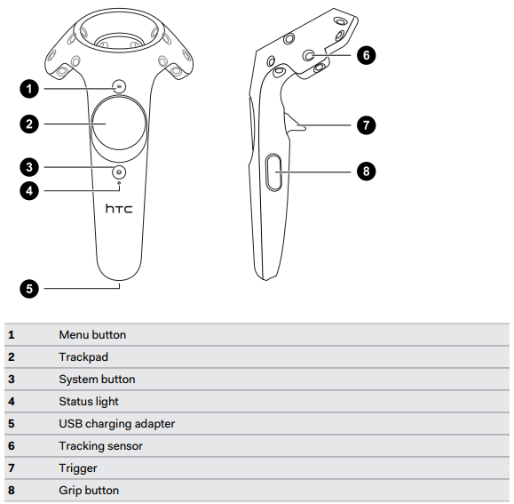

# HTC Vive teleop stuff

## Install

First, follow the [INSTALL](INSTALL.md) instructions to get Ubuntu 16.04 and SteamVR (beta) on your machine.

Install pyopenvr (it's not in `package.xml` dependencies as it needs to have HTC Vive SteamVR installed anyways, which is a manual process):
```bash
sudo pip install pyopenvr
```

To run my node you'll need to have installed basic ROS TF stuff:

```bash
# In case you are missing it
sudo apt-get install ros-kinetic-tf ros-kinetic-tf2*
```

Then check out and fake-compile (it's all Python) this repository in your catkin workspace:
```bash
mkdir -p vive_ws/src
cd vive_ws/src
git clone https://github.com/uts-magic-lab/htc_vive_teleop_stuff
cd ..
# or catkin build
catkin_make
source devel/setup.bash
```

You may also want to add [htc_vive_helper](https://github.com/uts-magic-lab/htc_vive_helper) to the workspace if you want to deal in a more user friendly fashion with the HTC Vive controllers.

## Run node
The node you want to run is [scripts/vive_tf_and_joy.py](scripts/vive_tf_and_joy.py) which is nicely prepared in a launchfile for you.
```bash
roslaunch htc_vive_teleop_stuff htc_vive_tf_and_joy.launch
```

You'll see plenty of output (that's the OpenVR initializing) and you may need to touch your controllers to get it started. Then you'll see the output: `Running!`

You'll find the topics:
```
Topic                   Type                Rate
/tf                     tf2_msgs/TFMessage  250Hz
/vive_left              sensor_msgs/Joy     On Event
/vive_right             sensor_msgs/Joy     On Event
/vive_left_vibration    std_msgs/Float64    Listening
/vive_right_vibration   std_msgs/Float64    Listening
```

The TF tree looks like (there is only one lighthouse because I only had one plugged in):


The `sensor_msgs/Joy` topics are as:
```
header: 
  seq: 541
  stamp: 
    secs: 1508649347
    nsecs: 147578954
# which controller
  frame_id: left_controller
# Trigger, Trackpad X, Trackpad Y
axes: [0.0, 0.0, 0.0]
# Trigger, Trackpad touched, Trackpad pressed, Menu, Gripper
buttons: [0, 0, 0, 0, 0]
```



This image pertains to HTC from [this user guide](http://www.htc.com/managed-assets/shared/desktop/vive/Vive_PRE_User_Guide.pdf).

Note that the systme button is unreadable. Pressing it will prevent the other keys from being read. 
Press it again to resume data transmission.

The vibration topics `/vive_SIDE_vibration` expect a `std_msgs/Float64` with a value in between **0.0 and 1.0** representing the strength of the vibration. Every publication makes it vibrate shortly. If you want long vibrations you need to publish multiple times. Note that if you abuse it you may slow down the publication of TF.

You can find another launch file called `vive_tf_joy_and_ps.launch` which in addition provides two topics:
```
Topic                               Type                        Rate
/left_controller_as_posestamped     geometry_msgs/PoseStamped   30Hz
/right_controller_as_posestamped    geometry_msgs/PoseStamped   30Hz
```

Which are the poses of the controllers in reference to the headset, useful for teleoperation purposes.
It uses [scripts/frame_as_posestamped.py](scripts/frame_as_posestamped.py) which is a commandline tool:
```bash
Usage:
./frame_as_posestamped.py frame_to_posestamped reference_frame [rate]
```
That takes a TF frame that you want published as a `geometry_msgs/PoseStamped` in reference to another frame, with
whatever rate you want.

## To run PR2 Teleop demo
*TODO*
```
sudo apt-get install libnlopt-dev
sudo apt-get install ros-kinetic-moveit-ros
sudo apt-get install swig

git clone https://bitbucket.org/awesomebytes/trac_ik
cd trac_ik
git checkout python_wrapper_swig_based

cd ../..
catkin_make
```


